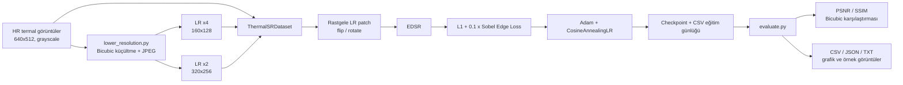
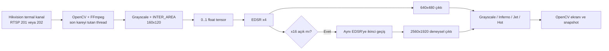
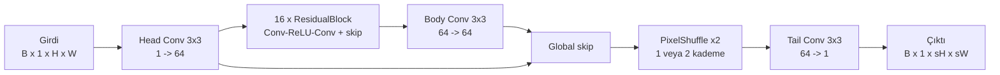

# ThermalDLSS - Termal Görüntü Süper Çözünürlük Sistemi

Bu depo, düşük çözünürlüklü tek kanallı termal görüntüleri EDSR tabanlı bir
sinir ağıyla büyütmek için hazırlanmış uçtan uca bir prototiptir. Proje;
yüksek çözünürlüklü görüntülerden sentetik LR veri üretimini, eşleştirilmiş
veri yüklemeyi, model eğitimini, PSNR/SSIM tabanlı değerlendirmeyi ve
Hikvision termal kamera akışı üzerinde canlı çıkarımı kapsar.

> [!IMPORTANT]
> Proje adı DLSS benzetmesini kullanır; mevcut uygulama NVIDIA DLSS değildir.
> Zamansal kareler, hareket vektörleri veya oyun motoru bilgisi kullanılmaz.
> Uygulanan yöntem tek görüntülü, uzamsal süper çözünürlüktür (SISR).

**Doküman durumu:** 23 Temmuz 2026 tarihinde depodaki kod, veri dizinleri,
checkpoint'ler, eğitim günlüğü ve değerlendirme çıktıları incelenerek
hazırlanmıştır.

## İçindekiler

- [1. Projenin amacı ve kapsamı](#1-projenin-amacı-ve-kapsamı)
- [2. Mevcut durum](#2-mevcut-durum)
- [3. Sistem mimarisi](#3-sistem-mimarisi)
- [4. Dizin ve dosya yapısı](#4-dizin-ve-dosya-yapısı)
- [5. Veri kümesi ve ön işleme](#5-veri-kümesi-ve-ön-işleme)
- [6. Model mimarisi](#6-model-mimarisi)
- [7. Kayıp fonksiyonu ve metrikler](#7-kayıp-fonksiyonu-ve-metrikler)
- [8. Kurulum](#8-kurulum)
- [9. Hızlı başlangıç](#9-hızlı-başlangıç)
- [10. Eğitim](#10-eğitim)
- [11. Değerlendirme](#11-değerlendirme)
- [12. Canlı Hikvision kamera demosu](#12-canlı-hikvision-kamera-demosu)
- [13. Üretilen artefaktlar](#13-üretilen-artefaktlar)
- [14. Mevcut deney sonuçları](#14-mevcut-deney-sonuçları)
- [15. Doğrulama ve test yaklaşımı](#15-doğrulama-ve-test-yaklaşımı)
- [16. Bilinen sınırlamalar ve teknik riskler](#16-bilinen-sınırlamalar-ve-teknik-riskler)
- [17. Güvenlik ve veri yönetişimi](#17-güvenlik-ve-veri-yönetişimi)
- [18. Sorun giderme](#18-sorun-giderme)
- [19. Geliştirme yol haritası](#19-geliştirme-yol-haritası)
- [20. Bakım ve devir teslim kontrol listesi](#20-bakım-ve-devir-teslim-kontrol-listesi)

## 1. Projenin amacı ve kapsamı

Termal kamera sensörü fiziksel olarak sınırlı sayıda piksel üretir. Bu proje,
düşük çözünürlüklü termal kareden daha büyük bir görüntü tahmin ederek nesne
sınırlarını ve sıcaklık geçişlerini görsel olarak daha belirgin hale getirmeyi
amaçlar.

Mevcut temel senaryo:

- Eğitim hedefi: `640x512` tek kanallı termal JPEG görüntü.
- Varsayılan x4 eğitim girdisi: `160x128`.
- Alternatif x2 eğitim girdisi: `320x256`.
- Canlı kamera girdisi: varsayılan olarak `160x120`.
- Canlı x4 çıktı: `640x480`.
- Opsiyonel iki geçişli x16 çıktı: `2560x1920`.

Model yeni piksel bilgisi **tahmin eder**; fiziksel sensör çözünürlüğünü veya
radyometrik ölçüm doğruluğunu artırmaz. Çıktılar görsel iyileştirme amacıyla
değerlendirilmelidir.

## 2. Mevcut durum

| Bileşen | Durum | Uygulama |
|---|---:|---|
| HR görüntülerden x2/x4 LR üretimi | Çalışıyor | `lower_resolution.py` |
| LR-HR dosya eşleştirme | Çalışıyor | `dataset.py` |
| Patch tabanlı eğitim ve augmentation | Çalışıyor | `dataset.py` |
| EDSR x2/x4 model | Çalışıyor | `model.py` |
| L1 + Sobel kenar kaybı | Çalışıyor | `losses.py` |
| Eğitim, validation ve checkpoint | Çalışıyor | `train.py` |
| Bicubic karşılaştırmalı test | Çalışıyor | `evaluate.py` |
| CSV/JSON/TXT raporu ve grafikler | Çalışıyor | `evaluate.py` |
| Hikvision RTSP üzerinde canlı x4 çıkarım | Çalışan prototip | `hikvision_dual_camera_demo.py` |
| İki geçişli x16 EDSR | Deneysel | `evaluate.py`, canlı demo |
| Optik görüntü rehberli süper çözünürlük | Uygulanmadı | Yalnızca tasarım belgesinde |
| GAN / Real-ESRGAN | Uygulanmadı | Yalnızca gelecek planında |
| YOLO nesne tespiti | Uygulanmadı | Yalnızca gelecek planında |
| Zamansal video süper çözünürlük | Uygulanmadı | Gelecek çalışma |
| Otomatik test ve CI | Bulunmuyor | Eklenmeli |
| Paket/versiyon kilidi | Bulunmuyor | `requirements.txt` veya `pyproject.toml` eklenmeli |

## 3. Sistem mimarisi

### 3.1 Eğitim ve değerlendirme akışı



### 3.2 Canlı çıkarım akışı



`HCNetSDK.dll` canlı demoda kamera oturumunu doğrulamak için yüklenir. Video
kareleri ise mevcut kodda native SDK callback zinciriyle değil, OpenCV'nin RTSP
yakalama yolu ile alınır.

## 4. Dizin ve dosya yapısı

```text
ThermalDlss/
├── README.md
├── model.py
├── losses.py
├── dataset.py
├── lower_resolution.py
├── train.py
├── evaluate.py
├── hikvision_dual_camera_demo.py
├── cam_sdk/
│   ├── HCNetSDK.dll
│   ├── PlayCtrl.dll
│   └── HCNetSDKCom/...
├── thermal database/
│   ├── thermal_dataset_split/
│   │   ├── train/
│   │   ├── val/
│   │   └── test/
│   ├── thermal_dataset_degraded/
│   │   ├── x2/{train,val,test}/
│   │   └── x4/{train,val,test}/
│   └── rgb_to_thermal_vid_map.json
├── checkpoints/
│   ├── best_model.pth
│   ├── last_checkpoint.pth
│   ├── checkpoint_epoch_*.pth
│   └── training_log.csv
├── evaluation_results/
│   ├── only4x/
│   └── 16x/
├── live_snapshots/
├── ThermalUpscale.pdf
├── loss ve model mimari ve PNSR,SSIM.md
├── cupy_conversion_diff.txt
├── hikvision_sdk_analysis_report.txt
└── yolo gan 16x.txt
```

### 4.1 Kaynak dosyaların sorumlulukları

| Dosya | Sorumluluk |
|---|---|
| `model.py` | Residual blok, PixelShuffle upscaler ve EDSR ağı |
| `losses.py` | Sobel kenar kaybı ve birleşik termal SR kaybı |
| `dataset.py` | LR-HR eşleştirme, normalizasyon, crop, augmentation, DataLoader |
| `lower_resolution.py` | HR görüntülerden paralel x2/x4 LR veri üretimi |
| `train.py` | Cihaz seçimi, eğitim, validation, metrikler, scheduler ve checkpoint |
| `evaluate.py` | Test metrikleri, bicubic baseline, görsel ve rapor üretimi |
| `hikvision_dual_camera_demo.py` | Kamera girişi, gerçek zamanlı çıkarım, ekran ve snapshot |

### 4.2 Tasarım ve geçmiş notlar

- `ThermalUpscale.pdf`: SISR ve optik rehberli SR için kavramsal el kitabı.
- `loss ve model mimari ve PNSR,SSIM.md`: EDSR, loss ve metrik tasarım notları.
- `cupy_conversion_diff.txt`: CPU ve CuPy veri işleme yollarının geçmiş karşılaştırması.
- `hikvision_sdk_analysis_report.txt`: Kamera SDK araştırma notu.
- `yolo gan 16x.txt`: GAN + YOLO için gelecek faz önerisi.

Bu dosyalardaki bazı ifadeler hedef mimariyi anlatır. Çalışan sistemin kesin
davranışı için Python kaynak dosyaları esas alınmalıdır.

## 5. Veri kümesi ve ön işleme

### 5.1 Mevcut veri hacmi

| Split | HR `640x512` | LR x2 `320x256` | LR x4 `160x128` |
|---|---:|---:|---:|
| Train | 12.505 | 12.505 | 12.505 |
| Validation | 1.563 | 1.563 | 1.563 |
| Test | 1.567 | 1.567 | 1.567 |
| **Toplam** | **15.635** | **15.635** | **15.635** |

Tüm görüntüler mevcut depoda `.jpg` ve `L` modunda, yani 8 bit grayscale olarak
saklanır.

`rgb_to_thermal_vid_map.json`, 3.749 RGB dosya adını karşılık gelen termal dosya
adıyla eşler. Mevcut SISR eğitim ve değerlendirme kodu bu JSON dosyasını
kullanmaz; dosya gelecekteki optik rehberli yaklaşım için veri izi niteliğindedir.

### 5.2 Eşleştirme kuralı

`ThermalSRDataset`, LR ve HR klasörlerindeki dosya adlarının kesişimini alır:

```text
HR: thermal database/thermal_dataset_split/{split}/ornek.jpg
LR: thermal database/thermal_dataset_degraded/x{scale}/{split}/ornek.jpg
```

Yalnızca iki tarafta da aynı ada sahip görüntüler kullanılır. Eşleşmeyen dosyalar
uyarı verilmeden veri kümesinin dışında kalır. Hiç eşleşme yoksa
`FileNotFoundError` oluşur.

### 5.3 LR üretimi

`lower_resolution.py` şu işlemleri uygular:

1. Görüntüyü açar ve gerekirse grayscale'e çevirir.
2. Genişlik ve yüksekliği ölçek faktörüne tam sayı bölmeyle küçültür.
3. Pillow `Image.BICUBIC` ile yeniden boyutlandırır.
4. Belirtilen kalitede JPEG olarak kaydeder.
5. Dosyaları `ProcessPoolExecutor` ile paralel işler.

Varsayılan JPEG kalitesi `95`, ölçekler `2 4`, worker sayısı CPU çekirdeği
sayısıdır.

> [!NOTE]
> Kavramsal PDF; blur, sensör gürültüsü ve sıkıştırma çeşitliliği içeren daha
> gerçekçi bir degradation modeli önerir. Mevcut kod yalnızca bicubic küçültme
> ve JPEG kaydı uygular.

### 5.4 Eğitim örneği dönüşümleri

- Görüntüler `[0, 255]` aralığından `float32 [0, 1]` aralığına çevrilir.
- Train splitinde LR görüntüden varsayılan `48x48` patch seçilir.
- x4 eğitimde karşılık gelen HR patch `192x192` olur.
- Yatay flip, dikey flip ve 90 derece rotasyon birbirinden bağımsız yüzde 50
  olasılıkla uygulanır.
- Validation ve test splitlerinde tam görüntü kullanılır, augmentation yapılmaz.

### 5.5 CuPy yolu

CuPy, CUDA ve `use_cupy=True` birlikte sağlanırsa crop ve augmentation GPU
belleğinde yapılır. Sonuç CuPy CUDA dizisinden PyTorch CUDA tensörüne çevrilir.
CuPy yoksa veya CUDA kullanılamıyorsa NumPy/PyTorch CPU yolu otomatik seçilir.

Windows'ta DataLoader worker sayısı kod tarafından `0` yapılır. Diğer
platformlarda `--num_workers` değeri kullanılır.

## 6. Model mimarisi

Model, termal görüntüler için tek kanala uyarlanmış EDSR'dir. Batch
Normalization kullanılmaz.



Varsayılan model:

| Özellik | Değer |
|---|---:|
| Girdi/çıktı kanalı | 1 |
| Feature kanalı | 64 |
| Residual blok | 16 |
| Residual scale | 1.0 |
| Kernel | `3x3`, padding `1` |
| Varsayılan büyütme | x4 |
| Eğitilebilir parametre | 1.515.265 |

Bir residual blok:

```text
x -> Conv(64,64,3) -> ReLU -> Conv(64,64,3) -> residual_scale -> + x
```

Upscaler, `Conv2d(64, 256, 3)` ardından `PixelShuffle(2)` ve ReLU kullanır.
x2 için bir, x4 için iki upscaler kademesi vardır.

> [!WARNING]
> Uygulama `scale_factor` değerini doğrulamaz. Mimari mantığı yalnızca x2 ve x4
> için tasarlanmıştır. Başka bir sayı vermek beklenen ölçekte çıktı
> üretmeyebilir.

## 7. Kayıp fonksiyonu ve metrikler

### 7.1 Eğitim kaybı

Toplam kayıp:

```text
L_total = L1(pred, target) + edge_weight * L_sobel(pred, target)
```

Varsayılan `edge_weight = 0.1` değeridir.

Sobel kenar kaybı, tahmin ve hedef için yatay/dikey gradyan büyüklüğünü çıkarır:

```text
edge = sqrt(grad_x^2 + grad_y^2 + 1e-6)
L_sobel = L1(edge_pred, edge_target)
```

Kenar kaybının amacı termal görüntülerdeki sıcaklık geçişlerini ve nesne
sınırlarını korumaktır. Perceptual ve adversarial loss mevcut kodda yoktur.

### 7.2 PSNR

Girdiler `[0, 1]` aralığında kabul edilir:

```text
PSNR = 10 * log10(1 / MSE)
```

MSE `1e-10` değerinden küçükse kod `100 dB` döndürür.

### 7.3 SSIM

Projedeki SSIM uygulaması:

- Varsayılan `11x11` uniform pencere kullanır.
- `C1 = 0.01^2`, `C2 = 0.03^2` sabitlerini kullanır.
- PyTorch `conv2d` ve sıfır padding ile hesaplanır.

Bu, yaygın kütüphanelerdeki Gaussian pencereli SSIM ile birebir aynı değildir.
Sonuçlar proje içindeki deneyler arasında karşılaştırılmalı; başka
implementasyonlardan gelen skorlarla doğrudan birleştirilmemelidir.

## 8. Kurulum

### 8.1 Gereksinimler

- Python 3.10 veya üzeri
- PyTorch
- NumPy
- Pillow
- tqdm
- Matplotlib
- OpenCV Python
- Opsiyonel: CUDA uyumlu CuPy
- Canlı demo için Windows, Hikvision 64 bit DLL'leri ve FFmpeg destekli OpenCV

Depoda sürümleri sabitleyen bir bağımlılık dosyası bulunmadığından aşağıdaki
kurulum bir başlangıç örneğidir:

```powershell
py -3.11 -m venv .venv
.\.venv\Scripts\Activate.ps1
python -m pip install --upgrade pip
python -m pip install torch numpy pillow tqdm matplotlib opencv-python
```

CuPy kullanmak için CUDA sürümünüzle eşleşen CuPy paketini ayrıca kurun. Örneğin
CUDA 12 ailesinde paket adı çoğunlukla `cupy-cuda12x` olur:

```powershell
python -m pip install cupy-cuda12x
```

Kurulumu kontrol edin:

```powershell
python -c "import torch; print(torch.__version__); print(torch.cuda.is_available())"
python -c "import cv2, numpy, PIL, tqdm, matplotlib; print('temel bağımlılıklar hazır')"
```

> [!TIP]
> PyTorch ve CuPy paketlerini GPU sürücüsü/CUDA ortamına uygun seçin. CPU
> kurulumu eğitim ve değerlendirmeyi çalıştırabilir, ancak belirgin ölçüde daha
> yavaştır.

## 9. Hızlı başlangıç

Komutları depo kök dizininde çalıştırın.

### 9.1 Model mimarisini kontrol et

```powershell
python model.py
```

Varsayılan test, `1x1x128x160` girdiden `1x1x512x640` çıktı bekler.

### 9.2 Küçük bir değerlendirme çalıştır

```powershell
python evaluate.py `
  --checkpoint "checkpoints\best_model.pth" `
  --max_samples 10 `
  --num_save_images 2 `
  --enable_16x false `
  --output_dir "evaluation_results\smoke_test"
```

### 9.3 Varsayılan x4 eğitimi başlat

```powershell
python train.py
```

## 10. Eğitim

### 10.1 Varsayılan yapılandırma

| Argüman | Varsayılan | Açıklama |
|---|---|---|
| `--hr_base` | `thermal database/thermal_dataset_split` | HR split kökü |
| `--lr_base` | `thermal database/thermal_dataset_degraded/x4` | LR split kökü |
| `--scale_factor` | `4` | Model büyütme faktörü |
| `--num_features` | `64` | Feature kanal sayısı |
| `--num_residual_blocks` | `16` | Residual blok sayısı |
| `--epochs` | `300` | En fazla epoch |
| `--batch_size` | `0` | Sıfırsa VRAM'e göre otomatik |
| `--patch_size` | `48` | LR train patch kenarı |
| `--lr` | `1e-4` | Adam başlangıç learning rate |
| `--edge_weight` | `0.1` | Sobel loss katsayısı |
| `--num_workers` | `4` | Windows dışındaki DataLoader worker sayısı |
| `--no_cupy` | Kapalı | Verilirse CPU ön işleme zorlanır |
| `--checkpoint_dir` | `checkpoints` | Model ve log dizini |
| `--resume` | Yok | Devam checkpoint'i |
| `--patience` | `20` | PSNR iyileşmezse early stopping |
| `--val_max_samples` | `300` | Epoch başına validation örneği; `0` tümü |

Otomatik batch seçimi yalnızca toplam VRAM'e bakar:

| VRAM | Batch |
|---:|---:|
| 10 GB ve üzeri | 16 |
| 6-10 GB | 8 |
| 4-6 GB | 4 |
| 4 GB altı | 2 |
| CPU | 4 |

### 10.2 x4 eğitim

```powershell
python train.py `
  --scale_factor 4 `
  --lr_base "thermal database\thermal_dataset_degraded\x4" `
  --epochs 300 `
  --patch_size 48
```

### 10.3 x2 eğitim

Ölçek değiştiğinde LR dizini de birlikte değiştirilmelidir:

```powershell
python train.py `
  --scale_factor 2 `
  --lr_base "thermal database\thermal_dataset_degraded\x2" `
  --checkpoint_dir "checkpoints_x2"
```

### 10.4 CPU/NumPy yolu

```powershell
python train.py --no_cupy --batch_size 4
```

### 10.5 Checkpoint'ten devam

```powershell
python train.py --resume "checkpoints\last_checkpoint.pth"
```

Checkpoint içeriği:

- `epoch`
- `model_state_dict`
- `optimizer_state_dict`
- `scheduler_state_dict`
- `best_psnr`
- Komut satırı argümanlarının `args` sözlüğü

Eğitim sırasında:

- Her epochun eğitim bölümünden sonra `last_checkpoint.pth` yazılır.
- Validation PSNR iyileşirse `best_model.pth` yazılır.
- Her 10 epochta `checkpoint_epoch_NNN.pth` yazılır.
- Ctrl+C sonrasında `interrupted_epoch_NNN.pth` yazılmaya çalışılır.
- Metrikler `training_log.csv` dosyasına eklenir.

Optimizer Adam, scheduler ise `eta_min=1e-6` değerli
`CosineAnnealingLR`'dır.

## 11. Değerlendirme

### 11.1 Varsayılan argümanlar

| Argüman | Varsayılan | Açıklama |
|---|---|---|
| `--checkpoint` | `checkpoints/best_model.pth` | Model ağırlıkları |
| `--hr_dir` | `thermal database/thermal_dataset_split/test` | HR test klasörü |
| `--lr_dir` | `thermal database/thermal_dataset_degraded/x4/test` | LR test klasörü |
| `--output_dir` | `evaluation_results` | Sonuç dizini |
| `--max_samples` | `0` | Sıfırsa tüm eşleşen görüntüler |
| `--num_save_images` | `50` | Rastgele görsel karşılaştırma sayısı |
| `--seed` | `42` | Görsel seçimi seed'i |
| `--enable_16x` | `true` | İkinci EDSR geçişi |
| `--scale_factor` | `4` | Kurulacak model ölçeği |
| `--num_features` | `64` | Kurulacak model feature sayısı |
| `--num_residual_blocks` | `16` | Kurulacak model blok sayısı |

### 11.2 Güvenilir x4 test

```powershell
python evaluate.py `
  --checkpoint "checkpoints\best_model.pth" `
  --enable_16x false `
  --output_dir "evaluation_results\only4x"
```

Her görüntü için:

1. LR ve HR dosyası açılır.
2. LR, bicubic ile HR boyutuna büyütülür.
3. EDSR x4 tahmini üretilir ve `[0, 1]` aralığına clamp edilir.
4. Bicubic ve model için HR hedefe karşı PSNR/SSIM hesaplanır.
5. Seçilen örneklerde LR, Bicubic, EDSR ve HR yan yana kaydedilir.

### 11.3 Deneysel x16 cascade

```powershell
python evaluate.py `
  --checkpoint "checkpoints\best_model.pth" `
  --enable_16x true `
  --output_dir "evaluation_results\16x"
```

x16 çıktı şu şekilde elde edilir:

```text
pred_4x  = EDSR(LR)
pred_16x = EDSR(pred_4x)
```

> [!CAUTION]
> Test kümesinde gerçek x16 HR hedef yoktur. Kod x16 EDSR çıktısını x16 bicubic
> çıktıya karşı ölçer. Buradaki “relatif PSNR/SSIM”, gerçek ayrıntı doğruluğunu
> veya x16 kalite kazanımını kanıtlamaz; yalnızca iki sentetik büyütmenin
> birbirine benzerliğini ölçer. İkinci EDSR geçişi ayrıca modelin eğitim
> dağılımının dışındadır.

### 11.4 Model argümanlarını eşleştirme

Checkpoint içindeki `args` ekrana okunur fakat `evaluate.py` mevcut haliyle
modeli bu kayıtlı argümanlarla yeniden kurmaz. Varsayılan dışı bir mimariyle
eğitilen checkpoint'i değerlendirirken `--scale_factor`, `--num_features` ve
`--num_residual_blocks` değerlerini eğitimle aynı vermek zorunludur.

## 12. Canlı Hikvision kamera demosu

### 12.1 Ön koşullar

- Windows x64.
- `cam_sdk/HCNetSDK.dll`, `PlayCtrl.dll` ve bağımlı DLL'ler.
- Kamera ile aynı ağa erişim.
- SDK portu (varsayılan 8000) ve RTSP portu 554 erişimi.
- Geçerli kamera kullanıcısı ve parolası.
- `checkpoints/best_model.pth`.
- Görüntü penceresi açabilen masaüstü oturumu.

### 12.2 Güvenli çalıştırma örneği

Parolayı komut geçmişine açık metin olarak yazmamak için geçici bir ortam
değişkeni kullanılabilir:

```powershell
$env:THERMAL_CAMERA_PASSWORD = Read-Host "Kamera parolası"
python hikvision_dual_camera_demo.py `
  --ip "192.168.1.128" `
  --user "admin" `
  --password "$env:THERMAL_CAMERA_PASSWORD" `
  --checkpoint "checkpoints\best_model.pth" `
  --single_view `
  --fp16
Remove-Item Env:THERMAL_CAMERA_PASSWORD
```

`--fp16` yalnızca CUDA cihazında etkili olur.

### 12.3 Kanal seçimi

- `--substream true`: termal kanal `202`.
- `--substream false`: termal kanal `201`.

Kod RTSP adresini şu kalıpla oluşturur:

```text
rtsp://<user>:<password>@<ip>:554/Streaming/Channels/<201|202>
```

### 12.4 Diğer argümanlar

| Argüman | Varsayılan | Açıklama |
|---|---|---|
| `--port` | `8000` | Hikvision SDK login portu |
| `--native_w` | `160` | Modele verilecek genişlik |
| `--native_h` | `120` | Modele verilecek yükseklik |
| `--colormap` | `gray` | `gray`, `inferno`, `jet`, `hot` |
| `--enable_16x` | Kapalı | Başlangıçta iki geçişli x16 |
| `--single_view` | Kapalı | Yalnızca x4 model çıktısı |
| `--fp16` | Kapalı | CUDA FP16 çıkarım |

### 12.5 Klavye kontrolleri

| Tuş | İşlev |
|---|---|
| `v` | Tek görünüm ve çoklu karşılaştırma arasında geçiş |
| `s` | Raw, bicubic, EDSR x4 ve açıksa x16 snapshot kaydet |
| `c` | Renk haritasını değiştir |
| `t` | Telemetri özetini konsola yaz |
| `1` | x16 cascade'i aç/kapat |
| `q` | Çıkış |

Snapshot'lar `live_snapshots/` dizinine PNG olarak yazılır.

### 12.6 Canlı akışın teknik davranışı

- FFmpeg TCP ve düşük tampon seçenekleri ortam değişkeniyle ayarlanır.
- Arka plan thread'i sürekli `grab/retrieve` yapar ve yalnızca son kareyi tutar.
- Gelen kare grayscale'e çevrilir.
- `INTER_AREA` ile `native_w x native_h` boyutuna getirilir.
- EDSR x4 çıkarımı yapılır; istenirse çıktı aynı modele ikinci kez verilir.
- Görüntüleme gecikmesi ana döngünün işlem süresidir.

“0 ms” ifadesi mutlak uçtan uca ağ gecikmesi ölçümü değildir. Kamera pozlama,
kodlama, ağ, decoder ve ekran gecikmeleri ayrıca ölçülmemektedir.

## 13. Üretilen artefaktlar

### 13.1 Checkpoint'ler

| Dosya | Amaç |
|---|---|
| `best_model.pth` | En yüksek validation PSNR görülen model |
| `last_checkpoint.pth` | Son tamamlanan eğitim bölümünün durumu |
| `checkpoint_epoch_NNN.pth` | Her 10 epochta periyodik kayıt |
| `interrupted_epoch_NNN.pth` | Durdurulan çalışmanın kaydı |
| `training_log.csv` | Epoch bazlı loss, PSNR, SSIM ve learning rate |

### 13.2 Değerlendirme çıktıları

| Dosya | İçerik |
|---|---|
| `evaluation_metrics.csv` | Örnek bazında bicubic/model metrikleri ve kazanım |
| `evaluation_summary.json` | Makinece okunabilir toplu özet |
| `evaluation_summary.txt` | İnsan tarafından okunabilir özet |
| `metrics_comparison_bar.png` | Ortalama PSNR/SSIM karşılaştırması |
| `psnr_distribution_line.png` | Test örnekleri boyunca PSNR |
| `psnr_gain_histogram.png` | Model-bicubic PSNR farkı dağılımı |
| `compare_*.jpg` | Yan yana görsel karşılaştırmalar |
| `16x_standalone/16x_*.jpg` | Ham deneysel x16 çıktılar |

## 14. Mevcut deney sonuçları

### 14.1 Eğitim günlüğü

`checkpoints/training_log.csv` içinde 94 epoch kaydı vardır.

| Ölçüm | Değer |
|---|---:|
| Logdaki en iyi validation epoch | 74 |
| En iyi validation PSNR | 29,7690 dB |
| Aynı epoch validation SSIM | 0,762441 |
| Son kayıtlı epoch | 94 |
| Son validation PSNR | 29,7341 dB |
| Son validation SSIM | 0,761290 |

Varsayılan eğitim ayarında validation her epoch en fazla ilk 300 örneği
kullanır. Bu nedenle eğitim günlüğündeki değerlerle tam test kümesi değerleri
aynı örneklemden gelmez.

### 14.2 Tam x4 test sonucu

`evaluation_results/only4x/evaluation_summary.json`, 1.567 test görüntüsünün
tamamı için aşağıdaki sonucu içerir:

| Yöntem | Ortalama PSNR | Ortalama SSIM |
|---|---:|---:|
| Bicubic x4 | 29,9793 dB | 0,712734 |
| EDSR x4 | 30,5971 dB | 0,729357 |
| **EDSR kazanımı** | **+0,6178 dB** | **+0,016623** |

En yüksek PSNR iyileşmesi görülen örnek:

```text
video-7EPybiwBrzjDKn7TZ-frame-002157-ekxksMeDD5CyRWXkW.jpg
```

Bu örnekte bicubic'e göre kazanım `+2,013 dB` olarak kaydedilmiştir.

Sonuçlar, kullanılan test kümesi, sentetik degradation süreci ve projeye özgü
SSIM implementasyonu bağlamında yorumlanmalıdır.

## 15. Doğrulama ve test yaklaşımı

Depoda otomatik test paketi yoktur. Değişiklik sonrası en az şu kontroller
yapılmalıdır:

1. Python sözdizimini tüm `.py` dosyalarında doğrula.
2. `python model.py` ile x4 tensör boyutunu doğrula.
3. Bir LR/HR örneğinin dosya adı, mod ve boyut eşleşmesini kontrol et.
4. `evaluate.py --max_samples 10 --enable_16x false` ile smoke test çalıştır.
5. Üretilen CSV/JSON dosyalarının boş olmadığını kontrol et.
6. En az bir karşılaştırma görselini gözle incele.
7. Kamera değişikliği varsa login, kare alımı, `q` ile temiz çıkış ve snapshot
   akışını gerçek donanımda test et.

Önerilen gelecekteki otomatik testler:

- `EDSR` x2/x4 çıktı boyutu ve parametre sayısı.
- LR-HR crop koordinat eşleşmesi.
- Augmentation sonrası LR-HR geometrik eşleşmesi.
- Sobel loss için eşit girdide sıfıra yakın sonuç.
- Checkpoint save/load round-trip.
- PSNR/SSIM bilinen sentetik örnekleri.
- Eşleşmeyen dosya ve küçük patch hata senaryoları.

## 16. Bilinen sınırlamalar ve teknik riskler

### 16.1 Model ve veri

- Eğitim verisi 8 bit JPEG'dir; ham radyometrik sıcaklık verisi değildir.
- Model çıktısı fiziksel sıcaklık ölçümü olarak kullanılamaz.
- Sentetik degradation gerçek termal lens blur'u, NETD gürültüsünü ve video
  codec artefakt çeşitliliğini tam modellemez.
- Eğitim tekrar üretilebilirliği için Python/NumPy/PyTorch seed'leri
  sabitlenmemiştir.
- Dataset, dosya adı kesişiminden düşen örnekleri raporlamaz.
- `patch_size`, LR boyutundan büyükse crop sırasında hata oluşur.
- x2/x4 dışındaki ölçekler doğrulanmaz.

### 16.2 Eğitim ve metrik

- Training validation varsayılan olarak yalnızca 300 örnek kullanır.
- Training validation PSNR'ı batch MSE'sinden hesaplanır; tekil görüntü PSNR
  ortalamasıyla tam olarak aynı değildir.
- SSIM standart Gaussian pencereli referans implementasyon değildir.
- Metrik hesaplamasında SR literatüründe sık kullanılan kenar kırpma uygulanmaz.
- `last_checkpoint.pth`, validation ve scheduler adımından önce kaydedilir; en
  güncel `best_psnr` ve scheduler durumunu her zaman içermeyebilir.
- Checkpoint dosyaları optimizer durumunu da içerdiği için salt model
  ağırlığından daha büyüktür.

### 16.3 Değerlendirme

- `evaluate.py`, checkpoint içinde kayıtlı mimari argümanlarını otomatik
  uygulamaz.
- x16 ölçümü gerçek ground truth'a dayanmaz.
- İkinci EDSR geçişi eğitim dağılımı dışındadır ve yapay detay üretebilir.
- x16 modu bellek ve işlem süresini önemli ölçüde artırır.
- x16 değerlendirme mantığı fiilen x4 model varsayar; x2 modelle
  kullanılmamalıdır.

### 16.4 Canlı kamera

- Eğitim x4 girdisi `160x128`, varsayılan canlı girdi `160x120`'dir. Ağ fully
  convolutional olduğu için çalışır, fakat yükseklik/aspect dağılımı farklıdır.
- Gelen akışı `160x120`'ye küçültmek gerçek sensör ham verisini SDK
  belleğinden okumakla eşdeğer değildir.
- Native SDK mevcut kodda login doğrulaması yapar; akış OpenCV RTSP'den gelir.
- `PlayCtrl.dll` yüklenir fakat frame callback çözümlemesinde kullanılmaz.
- Telemetride yazılan gecikme ağın uçtan uca gecikmesi değil döngü süresidir.
- Kamera SDK oturumu normal çıkışta açıkça `logout()` ile kapatılmıyor.
- RTSP kullanıcı adı ve parolayı URL içinde taşır.
- OpenCV penceresi headless/sunucu oturumunda çalışmaz.

### 16.5 Depo ve bakım

- `requirements.txt`, `pyproject.toml`, lisans, `.gitignore` ve CI yapılandırması
  yoktur.
- Veri, checkpoint, cache ve sonuç dosyaları depoyu çok büyütmektedir.
- Mevcut çalışma ağacında büyük miktarda silinmiş/eski veri izi bulunabilir;
  veri saklama politikası netleştirilmeden toplu Git temizliği yapılmamalıdır.
- SDK DLL'lerinin dağıtım ve lisans koşulları ayrıca kontrol edilmelidir.

## 17. Güvenlik ve veri yönetişimi

> [!CAUTION]
> Canlı demo kaynak dosyasında varsayılan kamera parolası açık metin olarak
> bulunuyor. Bu parola ifşa olmuş kabul edilmeli, kamerada değiştirilmeli ve
> kaynak koddan kaldırılmalıdır.

Önerilen güvenlik düzeni:

1. Kamera parolasını hemen döndürün.
2. Parolayı CLI varsayılanı yerine ortam değişkeni veya yerel secret store'dan
   okuyun.
3. Gerçek `.env` dosyasını Git'e eklemeyin; yalnızca anahtar adlarını gösteren
   `.env.example` kullanın.
4. RTSP URL'sini, parolayı ve checkpoint içindeki hassas metadata'yı loglamayın.
5. Kamera hesabına yalnızca gerekli yetkileri verin.
6. SDK ve RTSP portlarını güvenilir ağla sınırlandırın.
7. Termal/optik görüntülerde kişi veya hassas tesis verisi varsa erişim, saklama
   ve anonimleştirme politikasını belirleyin.
8. Model ve değerlendirme artefaktlarını paylaşmadan önce dosya yolları ve
   metadata'yı inceleyin.

## 18. Sorun giderme

### Eşleşen dosya bulunamadı

- HR ve LR klasör yollarını kontrol edin.
- Aynı splitte dosya adlarının birebir aynı olduğundan emin olun.
- Desteklenen uzantılar `.jpg`, `.jpeg`, `.png`'dir.

### Crop sırasında `randint` hatası

`--patch_size`, LR görüntünün kısa kenarından büyük olabilir. x4 veri için
varsayılan `48`, `160x128` görüntüye uygundur. Daha küçük LR görüntülerde patch
boyutunu düşürün.

### CUDA bellek hatası

- `--batch_size` değerini düşürün.
- `--patch_size` değerini düşürün.
- x16 değerlendirmeyi kapatın.
- Canlı demoda `--single_view` kullanın.
- GPU destekliyorsa `--fp16` deneyin.

### CuPy bulunamıyor veya CUDA uyumsuz

- CUDA sürümünüzle uyumlu CuPy paketini kurun.
- Ön işlemeyi CPU'ya almak için `--no_cupy` kullanın.
- PyTorch ve CuPy'nin aynı CUDA cihazını gördüğünü ayrı ayrı kontrol edin.

### Checkpoint yüklenirken `size mismatch`

Checkpoint'in eğitim mimarisiyle aynı değerleri kullanın:

```powershell
python evaluate.py `
  --scale_factor 4 `
  --num_features 64 `
  --num_residual_blocks 16
```

### Kamera login başarısız

- IP, kullanıcı, parola ve SDK portunu kontrol edin.
- `cam_sdk/HCNetSDK.dll` ve bağımlı DLL'lerin aynı mimaride olduğundan emin olun.
- Windows güvenlik duvarı ve kamera hesap kilidini kontrol edin.
- SDK hata kodunu Hikvision SDK hata kodu tablosuyla eşleştirin.

### Kamera login oluyor fakat görüntü gelmiyor

- RTSP portu 554'e erişimi kontrol edin.
- Kanal 202 yerine `--substream false` ile 201'i deneyin.
- OpenCV kurulumunun FFmpeg desteğini doğrulayın.
- Kamera codec ayarını H.264 ile test edin.
- Aynı RTSP adresini yetkili bir video istemcisinde doğrulayın.

### Türkçe karakterler bozuk görünüyor

Kaynak dosyalar UTF-8'dir. PowerShell 7 veya UTF-8 terminal kullanın:

```powershell
$OutputEncoding = [Console]::OutputEncoding = [Text.UTF8Encoding]::new()
```

## 19. Geliştirme yol haritası

### P0 - Güvenlik ve yeniden üretilebilirlik

- Kaynak koda gömülü kamera kimlik bilgisini kaldır ve parolayı döndür.
- `requirements.txt` veya `pyproject.toml` ile sürümleri sabitle.
- `.gitignore` ekle; veri, checkpoint, cache ve sonuç politikasını tanımla.
- Eğitim seed'i, ortam ve donanım bilgisini logla.
- Temel pytest paketi ve CI oluştur.

### P1 - Deney doğruluğu

- Checkpoint mimari argümanlarını değerlendirmede otomatik uygula.
- LR/HR eşleşme raporu ve veri bütünlük kontrolü ekle.
- Standart, doğrulanmış SSIM implementasyonu kullan.
- Görüntü başına PSNR/SSIM ortalamasını training validation'a taşı.
- Degradation sürecine blur, sensör gürültüsü ve codec çeşitliliği ekle.
- `160x120 -> 640x480` kamera boyutuyla uyumlu eğitim/veri stratejisi belirle.

### P2 - Canlı sistem

- Parolayı secret store veya güvenli ortam değişkeninden al.
- Akış kopunca yeniden bağlanma ve sağlık durumu ekle.
- SDK oturumunu `finally` bloğunda temiz kapat.
- Uçtan uca gecikmeyi kamera zaman damgasıyla ölç.
- Native `NET_DVR_RealPlay` + `PlayM4_SetDecCallBack` akışını gerçekten uygula
  veya dokümandaki native iddiaları kaldır.
- FPS, GPU bellek ve çıkarım süresini yapılandırılmış logla.

### P3 - Araştırma fazları

- Gerçek x16 HR hedefli veri ve ayrı x16 model tasarımı.
- Optik sensörle kalibrasyon, registration ve guided SR.
- Zamansal tutarlılık kaybı ve video SR.
- YOLO öncesi/sonrası mAP karşılaştırması.
- GAN kullanılırsa halüsinasyon ve termal yanlış pozitif risk analizi.
- ONNX/TensorRT dışa aktarma ve edge deployment.

## 20. Bakım ve devir teslim kontrol listesi

Yeni bir geliştirici projeyi devralırken:

- [ ] Python/CUDA/PyTorch/CuPy sürümlerini kayıt altına al.
- [ ] Veri split sayıları ve örnek boyutlarını doğrula.
- [ ] Kamera parolasının kaynak kodda olmadığını doğrula.
- [ ] `best_model.pth` ile 10 örneklik smoke test çalıştır.
- [ ] Tam test sonucunu yeni bir çıktı dizinine üret.
- [ ] Sonuçları mevcut bicubic ve EDSR değerleriyle karşılaştır.
- [ ] Eğitim başlatmadan checkpoint hedef dizinini doğrula.
- [ ] Veri üretirken mevcut LR klasörlerinin üzerine yazılmadığını doğrula.
- [ ] Kamera testinde SDK login ve RTSP frame alımını ayrı ayrı doğrula.
- [ ] x16 sonuçlarını ground-truth kalite metriği olarak raporlama.
- [ ] Değişiklik sonrası bu README'yi güncelle.

---

Bu doküman mevcut depo davranışını açıklar. Kavramsal arka plan ve daha geniş
araştırma seçenekleri için `ThermalUpscale.pdf`; model/loss tasarım geçmişi için
`loss ve model mimari ve PNSR,SSIM.md` incelenebilir.
