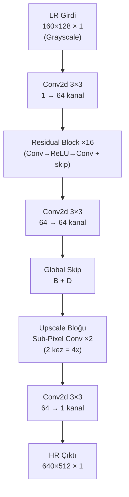
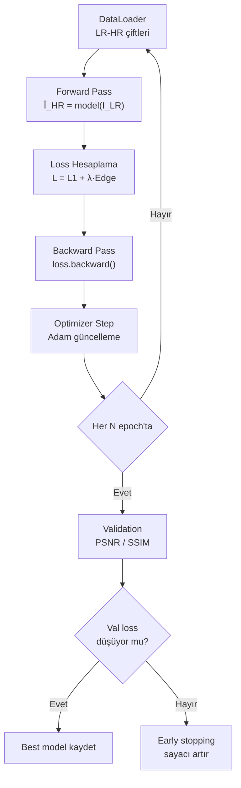

# Thermal Süper Çözünürlük — Model ve Loss Tasarım Planı

PDF el kitabının **Yol A: Tek Görüntülü Süper Çözünürlük (SISR)** bölümüne (Adım 3, 4, 5, 6) dayanarak hazırlanmıştır.

---

## 1. Model Mimarisi: EDSR (Enhanced Deep Residual SR)

PDF'nin önerisi: *"Staj sürecinde önce SRCNN/EDSR seviyesinde başlanması, GAN tabanlı yaklaşımların ileri aşamaya bırakılması"*

SRCNN yerine **EDSR** seçildi çünkü:
- Residual connections sayesinde daha derin/stabil eğitim
- Sub-pixel upsampling ile verimli büyütme
- SRCNN'den önemli ölçüde daha iyi sonuç, GAN kadar riskli değil
- Thermal grayscale (1 kanal) veriye kolay adapte edilir

### Mimari Şeması



### Detaylı Mimari

```
Katman                        Çıktı Boyutu         Parametre
─────────────────────────────────────────────────────────────
Input                         160×128×1             -
Conv2d(1, 64, 3, pad=1)       160×128×64            640
                                                    
ResBlock ×16                  160×128×64             
  ├─ Conv2d(64, 64, 3, pad=1)                       36,928
  ├─ ReLU                                           -
  ├─ Conv2d(64, 64, 3, pad=1)                       36,928
  └─ Skip connection (+)                            -
  (Her blok: ~73K param, 16 blok: ~1.18M)
                                                    
Conv2d(64, 64, 3, pad=1)      160×128×64            36,928
Global skip (+)               160×128×64            -
                                                    
Upscale ×4 (iki aşamalı):                           
  Conv2d(64, 256, 3, pad=1)   160×128×256           147,712
  PixelShuffle(2)             320×256×64             -
  Conv2d(64, 256, 3, pad=1)   320×256×256           147,712
  PixelShuffle(2)             640×512×64             -
                                                    
Conv2d(64, 1, 3, pad=1)       640×512×1             577
─────────────────────────────────────────────────────────────
Toplam parametre:             ~1.5M (hafif model)
```

> [!NOTE]
> **Neden Sub-Pixel Convolution (PixelShuffle)?**
> - Transposed convolution'daki checkerboard artifact'i oluşmaz
> - Hesaplama düşük boyutta yapılır → hızlı
> - EDSR ve çoğu modern SR modelinin standardı

### Kod Yapısı

#### [NEW] `model.py`

```python
class ResidualBlock(nn.Module):
    """Conv → ReLU → Conv + skip connection"""

class EDSR(nn.Module):
    """
    - head: Conv2d(1, 64, 3)           # Grayscale girdi
    - body: 16 × ResidualBlock(64)     # Öznitelik çıkarma
    - upscale: 2 × (Conv + PixelShuffle(2))  # 4x büyütme
    - tail: Conv2d(64, 1, 3)           # Grayscale çıktı
    """
```

> [!IMPORTANT]
> **Batch Normalization KULLANILMIYOR** — EDSR makalesinin temel bulgularından biri: BN kaldırıldığında SR performansı artar. Bu, EDSR'yi ResNet'ten ayıran en önemli fark.

---

## 2. Kayıp Fonksiyonları (Loss Functions)

PDF'deki tablo ve öneriler doğrultusunda, **3 katmanlı bir loss** tasarlanacak:

### Loss Kombinasyonu

```
L_total = λ₁ · L_pixel + λ₂ · L_edge + λ₃ · L_perceptual
```

| Loss | Ağırlık (λ) | Açıklama |
|------|-------------|----------|
| **L1 Piksel Kaybı** | `λ₁ = 1.0` | Piksel bazında mutlak fark (L2/MSE yerine L1 → daha keskin sonuçlar) |
| **Edge Loss (Sobel)** | `λ₂ = 0.1` | Sobel gradyan filtresi ile kenar farkı cezalandırma |
| **Perceptual Loss** | `λ₃ = 0.01` | VGG16 feature space'te karşılaştırma (opsiyonel, sonra eklenebilir) |

### 2.1 L1 Piksel Kaybı (Temel)

```python
L_pixel = |Î_HR - I_HR|₁   # Mean Absolute Error
```

PDF: *"Piksel kaybı (L1/L2) — Temel kayıp, her zaman kullanılır"*

**Neden L1, L2 değil?**
- L2 (MSE) ortalamaya çeker → bulanık sonuçlar
- L1 medyana çeker → daha keskin kenarlar
- SR literature'da L1 standart oldu

### 2.2 Edge Loss — Sobel Gradyan Kaybı

```python
# Sobel filtresi ile kenar haritası çıkar
edges_pred = sobel(Î_HR)
edges_gt   = sobel(I_HR)
L_edge = |edges_pred - edges_gt|₁
```

PDF: *"Kenar kaybı (edge loss) — Gradyan farkını cezalandırır. Termal görüntülerde kenar netliği kritik olduğundan önerilir"*

> [!IMPORTANT]
> Thermal görüntülerde kenarlar = sıcaklık geçişleri. İnsan, araç, bina sınırlarının net olması kritik. Edge loss bu yüzden **özellikle thermal SR için** çok önemli.

### 2.3 Perceptual Loss (Opsiyonel — İkinci Aşama)

```python
# VGG16'nın ara katmanlarından öznitelik çıkar
feat_pred = vgg16_features(Î_HR)  # Grayscale → 3 kanala kopyala
feat_gt   = vgg16_features(I_HR)
L_perceptual = |feat_pred - feat_gt|₂²
```

PDF: *"Algısal kayıp — Bulanık sonuçları önlemek için"*

> [!WARNING]
> VGG16 RGB görüntülerle eğitildi, thermal grayscale'de etkisi sınırlı olabilir. **Öneri:** İlk eğitimde sadece L1 + Edge Loss kullan, perceptual loss'u sonradan dene.

### Kod Yapısı

#### [NEW] `losses.py`

```python
class SobelEdgeLoss(nn.Module):
    """Sobel filtresi ile kenar farkı hesaplar"""

class PerceptualLoss(nn.Module):
    """VGG16 feature-matching loss (opsiyonel)"""

class ThermalSRLoss(nn.Module):
    """
    Kombine loss: L1 + λ_edge * EdgeLoss + λ_perceptual * PerceptualLoss
    Ağırlıklar argparse ile ayarlanabilir.
    """
```

---

## 3. Eğitim Döngüsü

PDF'nin Adım 5'ine dayanarak:

### Eğitim Pipeline'ı



### Hiperparametreler

| Parametre | Değer | Kaynak |
|-----------|-------|--------|
| Optimizer | Adam | PDF Adım 5.4 |
| Learning rate | `1e-4` | EDSR standardı |
| LR scheduler | CosineAnnealing veya StepLR | — |
| Batch size | 16 | GPU belleğine göre ayarlanır |
| Epoch | 200–500 | Early stopping ile |
| Patch boyutu | 48×48 (LR), 192×192 (HR) | Bellek optimizasyonu |
| Data augmentation | Döndürme (90°/180°/270°), aynalama (yatay/dikey) | PDF Bölüm 6.1 |
| Early stopping patience | 20 epoch | PDF: "doğrulama kaybı artmaya başladığında" |

> [!NOTE]
> **Patch-based eğitim:** Tam boyutlu görüntüler (640×512) yerine, rastgele kırpılmış patch'ler kullanılır. Bu:
> - Bellek kullanımını azaltır
> - Daha büyük batch size sağlar
> - Data augmentation etkisini artırır

### Kod Yapısı

#### [NEW] `dataset.py`

```python
class ThermalSRDataset(Dataset):
    """
    - LR ve HR görüntü dizinlerini tarar
    - Dosya adına göre eşleştirir
    - Rastgele patch kırpma yapar
    - Data augmentation uygular (flip, rotate)
    - Normalize eder ([0, 255] → [0, 1])
    """
```

#### [NEW] `train.py`

```python
"""
Ana eğitim scripti:
- Argparse ile tüm hiperparametreler ayarlanabilir
- Train / validation döngüsü
- Checkpoint kaydetme (best + son)
- TensorBoard / CSV loglama
- PSNR / SSIM metrik takibi
- Early stopping
"""
```

---

## 4. Değerlendirme Metrikleri

PDF Adım 6'ya dayanarak:

| Metrik | Açıklama | Hedef |
|--------|----------|-------|
| **PSNR** | Peak Signal-to-Noise Ratio | ↑ Yüksek = daha iyi |
| **SSIM** | Structural Similarity Index | ↑ Yüksek = daha iyi (max 1.0) |
| **Görsel karşılaştırma** | LR / Bicubic / Model / HR yan yana | Rapor için |

#### [NEW] `evaluate.py`

```python
"""
Test seti üzerinde değerlendirme:
- PSNR, SSIM hesaplama
- Örnek çıktıları kaydetme (LR | Bicubic | SR | HR grid)
"""
```

---

## 5. Dosya Yapısı Özeti

```
ThermalDlss/
├── lower_resolution.py      ← Zaten yazıldı (degradation)
├── dataset.py               ← [NEW] LR-HR paired dataset
├── model.py                 ← [NEW] EDSR mimarisi
├── losses.py                ← [NEW] L1 + Edge + Perceptual
├── train.py                 ← [NEW] Eğitim döngüsü
├── evaluate.py              ← [NEW] Test ve metrikler
└── thermal database/
    ├── thermal_dataset_split/      ← HR (Ground Truth)
    └── thermal_dataset_degraded/   ← LR (Model Girdisi)
        ├── x2/
        └── x4/
```

---

## Açık Sorular

> [!IMPORTANT]
> **1. GPU durumu:** Eğitim için hangi GPU'yu kullanacaksın? (CUDA desteği, VRAM boyutu batch size ve model boyutunu belirler)

> [!IMPORTANT]
> **2. Öncelikli scale factor:** İlk eğitimde 4x mi yoksa 2x mi odaklanalım? (Kamera 160×120 olduğuna göre 4x daha gerçekçi, ama 2x daha kolay öğrenilir — ilk baseline 2x ile başlayıp sonra 4x'e geçmek bir opsiyon)

> [!IMPORTANT]
> **3. Perceptual Loss:** İlk aşamada sadece L1 + Edge Loss ile mi başlayalım, yoksa perceptual loss'u da en baştan ekleyelim mi?


PNSR VE SSIM

**PSNR** ve **SSIM**, görüntü işleme ve Süper Çözünürlük (*Super-Resolution*) modellerinde oluşturulan görüntünün kalitesini ve orijinal (HR) görüntüye ne kadar benzediğini ölçmek için kullanılan iki temel metriktir.

---

### 1. PSNR (Peak Signal-to-Noise Ratio - Tepe Sinyal Gürültü Oranı)

Görüntünün **piksel düzeyindeki hatalarını (MSE - Ortalama Kare Hata)** temel alarak ölçer. Oluşturulan piksel değerleri ile orijinal piksel değerleri arasındaki farka bakar.

* **Birim:** Desibel (dB)
* **En Kötü Değer:** **`0 dB`** *(MSE çok büyükse sıfıra yaklaşır veya 0 olur)*
* **Mükemmel Değer:** **$\infty$ (Sonsuz dB)** *(Oluşturulan görüntü ile orijinal görüntü **%100 piksel piksel aynıysa** hata sıfır olur ve PSNR sonsuz çıkar)*

#### 📊 PSNR Değerleri Nasıl Yorumlanır?
| PSNR Değeri | Kalite Seviyesi | Açıklama |
| :--- | :--- | :--- |
| **< 20 dB** | 🔴 Çok Kötü | Görüntüde aşırı gürültü, bozulma ve pikselleşme var. |
| **20 - 25 dB** | 🟠 Düşük Kalite | Belirgin bulanıklık ve detay kaybı mevcut. |
| **25 - 30 dB** | 🟡 Kabul Edilebilir / Orta | Görüntü anlaşılır ancak ince detaylar kayıp (Termal görüntülerde sık görülür). |
| **30 - 35 dB** | 🟢 İyi / Yüksek Kalite | Detaylar ve kenarlar başarılı şekilde oluşturulmuş. |
| **> 35 dB** | 🔵 Çok Yüksek Kalite | Görüntü orijinallerine neredeyse ayırt edilemeyecek kadar yakın. |

---

### 2. SSIM (Structural Similarity Index Measure - Yapısal Benzerlik İndeksi)

İnsan gözünün görüntüyü algılama biçimini simüle eder. Piksel piksel fark yerine görüntünün **parlaklığı (luminance), kontrastı ve yapısal/doku özelliklerine (structure/edges)** bakar.

* **Birim:** 0 ile 1 arasında oran (veya yüzdelik %)
* **En Kötü Değer:** **`0`** *(veya teorik olarak tam zıt görüntülerde `-1`, hiçbir yapısal benzerlik yok)*
* **Mükemmel Değer:** **`1.0` (%100)** *(Görüntü yapısal ve dokusal olarak orijinal ile tamamen identik)*

#### 📊 SSIM Değerleri Nasıl Yorumlanır?
| SSIM Değeri | Kalite Seviyesi | Açıklama |
| :--- | :--- | :--- |
| **< 0.60** | 🔴 Kötü | Yapısal benzerlik çok zayıf, nesne kenarları ve şekiller bozulmuş. |
| **0.60 - 0.75**| 🟠 Orta | Genel hatlar belli ancak dokular ve keskin kenarlar eksik (Bicubic standart büyütmeler genelde bu banttadır). |
| **0.75 - 0.85**| 🟢 İyi | Nesne sınırları, termal sıcaklık geçişleri ve kenarlar oldukça net. |
| **0.85 - 0.95**| 🔵 Çok İyi | İnsan gözüyle bakıldığında orijinal ile yapısal olarak neredeyse farksız. |
| **> 0.95** | 🌟 Mükemmele Yakın | Yapısal doku ve detaylar birebir korunmuş. |

---

### ⚖️ PSNR ve SSIM Arasındaki Fark Nedir?

* **PSNR (Piksel Hassasiyeti):** Görüntünün genelindeki piksel parlaklık hatalarını toplar. Bazen görüntü 1-2 piksel kaysa bile PSNR düşebilir ama görüntü göze güzel gelebilir.
* **SSIM (Yapısal/Görsel Hassasiyet):** İnsan gözünün algısına daha yakındır. Termal kameralarda **insan/araç nesne sınırlarının (edges)** ve sıcaklık dokularının ne kadar korunduğunu anlamak için **SSIM** çok kritik bir metriktir.

---

### 🎯 Kendi Modelinizin Çıktılarını Nasıl Değerlendirmelisiniz?

Super-Resolution projelerinde başarının ana kriteri **Bicubic (Geleneksel Büyütme)** yöntemine göre modelinizin ne kadar gelişme sağladığıdır:

* **Bicubic (Baseline):** `PSNR: 30.22 dB` | `SSIM: 0.7602`
* **EDSR (Modeliniz):** `PSNR: 30.72 dB` | `SSIM: 0.7799`
* **Kazanım (Fark):** **`+0.50 dB PSNR`** ve **`+0.0197 SSIM`**

> 💡 **Özet:** 
> Modelinizin başarısını değerlendirirken mutlak sayıdan ziyade **Bicubic farkına** bakın. 
> * PSNR değerinde **+0.5 dB ila +1.5 dB** ve SSIM değerinde **+0.01 ila +0.03** kazanım sağlamak derin öğrenme modelleri (EDSR/RCAN/SRGAN vb.) için **başarılı bir gelişme** anlamına gelir.